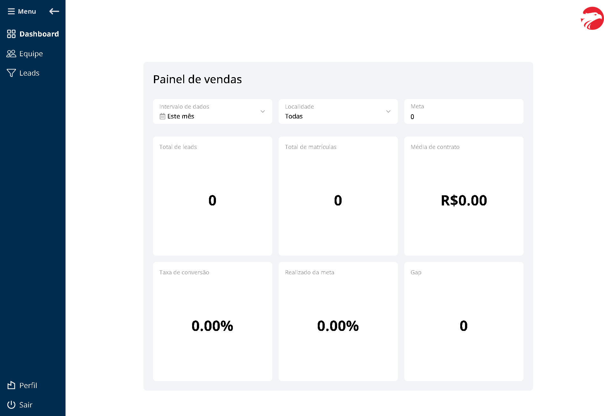

# Wizard ON

Full stack application created for Wizard branches to manage and monitor their employees' work. Employees can register customers, and the company can easily access all data related to these registered customers and employees.

## Technologies Used

- Next.js
- TypeScript
- PostgreSQL
- bcrypt
- JSONWebToken
- CSS

## Screenshots

